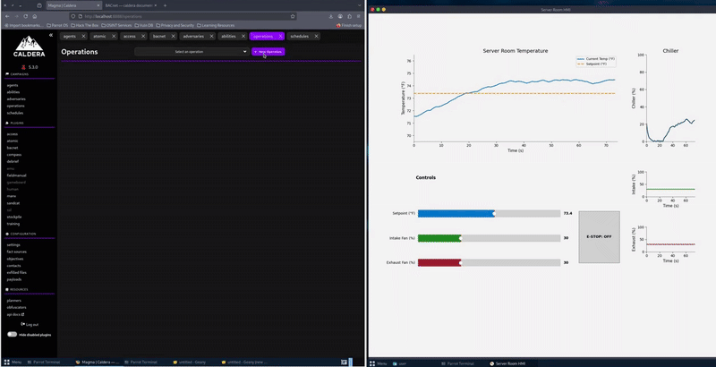

# HVACSim: BACnet Server Room HVAC Simulator

A simulated HVAC control system using BACnet/IP, designed as a companion to **MITRE Caldera for OT** for red/blue-team exercises involving cyber–physical systems.



## Description

**HVACSim** provides a realistic, software-only BACnet simulation of a server-room HVAC controller. The system exposes writable BACnet objects (setpoint, fans, emergency stop) and simulates:

* Temperature dynamics
* Chiller load and PI feedback loop
* Sensor noise and an actuator lag
* An HMI with sliders, trend charts, and an emergency-stop; the HMI is intended to easily observe overrides by the Caldera for OT client.

This allows cybersecurity practitioners to emulate attacks against building HVAC systems without requiring physical industrial hardware. When paired with the [Caldera BACnet plugin](https://github.com/mitre/bacnet), HVACSim becomes an OT testbed for reconnaissance, manipulation, and response.

## Getting Started

### Dependencies

* Python 3.10+
* `matplotlib` (for the HMI)
* `bacpypes` (BACnet/IP stack)
* Should run on Linux, macOS, or Windows
* **Caldera** with its BACnet plugin

  * [Caldera installation instructions](https://github.com/mitre/caldera?tab=readme-ov-file#requirements)

### Installation

1. Clone the repository:

```bash
git clone https://github.com/elijah-saloma/MITRE_SimEnv.git
```

2. Install Python dependencies:

```bash
pip install -r requirements.txt
```

3. You can have a variety of different INI files specifying different port numbers or other BACnet communications parameters. Visit the [BACpypes documentation](https://bacpypes.readthedocs.io/en/stable/samples/sample001.html) to learn more about this INI file.

Example provided in repo root (`BACpypes.ini`):

```
[BACpypes]
objectName: HVACSim
objectIdentifier: 101
maxApduLengthAccepted: 1024
segmentationSupported: segmentedBoth
vendorIdentifier: 15
address: 127.0.0.1
```

## Usage

### Step 1: Start the Simulator

```bash
python3 hvac_sim.py --ini ./BACpypes.ini
```

Launching the script does three things:

1. Starts the BACnet/IP device
2. Spawns the HVAC control loop thread
3. Opens the interactive HMI dashboard

If the program fails to start, verify Python, dependencies, and the `.ini` file. Any exceptions should be printed in the console.

### Step 2: Read/Write Properties

To "attack" the device, one can access property values (i.e., read) and modify them as desired (i.e., write). Below is an example of the commands to set in the adversary profile in Caldera (or through CLI):

#### ReadProperty (bacrp)

The ReadProperty service is used by a BACnet client to request the value of one property from one BACnet object.

##### Usage

```
./bacrp <device-instance> <object-type> <object-instance> <property> <index>
```

##### Example: Read current temperature from AI:0

```
./bacrp 101 analog-input 0 presentValue -1
```

#### WriteProperty (bacwp)

The WriteProperty service is used by a BACnet client to write a value to a specific property of a BACnet object.

##### Usage

```
./bacwp <device-instance> <object-type> <object-instance> <property> <priority> <index> <tag> <value>
```

##### Example 1: Set temperature setpoint on AO:0 to 18°C

```
./bacwp 101 analog-output 0 presentValue 8 -1 real 18.0
```

##### Example 2: Override/increase intake fan speed to 75%

```
./bacwp 101 analog-output 1 presentValue 8 -1 real 75.0
```

##### Example 3: Trigger Emergency Stop 🛑

```
./bacwp 101 binary-output 0 presentValue 8 -1 boolean true
```

## BACnet Object Map

The simulator exposes the following BACnet objects:

| Type    | Object Name                 | Description                               |
| ------- | --------------------------- | ----------------------------------------- |
| **AO0** | `temperature_setpoint_c`    | Desired room temperature in °C (writable) |
| **AO1** | `intake_fan_speed_percent`  | Intake fan command (0–100%)               |
| **AO2** | `exhaust_fan_speed_percent` | Exhaust fan command (0–100%)              |
| **BO0** | `emergency_stop`            | Safety kill switch for chiller/fans       |
| **AI0** | `current_temperature_c`     | Measured room temperature (°C)            |
| **AI1** | `chiller_speed_percent`     | PI-controlled chiller load (%)            |

## Understanding the Process Simulation

> **Disclaimer:** HVACSim models core thermal dynamics, but its primary purpose is to support Caldera/BACnet testing rather than to serve as a fully accurate physical HVAC model.

### 1. Room Thermal Model

The simulator continuously computes room temperature using:

* **Ambient heat** entering from the outside
* **Internal server load** (internal heat source)
* **Airflow-based cooling**
* **Chiller-based cooling**
* **Temperature sensor noise**
* **Actuator lag**

The temperature differential follows:

```
dT_dt = ((ambient + internal_load) - room_temp) / room_time_constant \
        - (cooling_from_fans + cooling_from_chiller)
```

### 2. Airflow Cooling

The intake and exhaust sliders (or Caldera writes) produce an airflow percentage:

```
airflow = (intake + exhaust) / 2
```

Cooling power is proportional to airflow:

```
cooling_airflow = (airflow / 100) * AIRFLOW_MAX_COOL
```

### 3. Chiller Logic (PI Controller)

The chiller is controlled by a **Proportional-Integral (PI)** loop:

```
error = current_temp - setpoint

integral = integral + error * tick

chiller_target = KP * error + KI * integral
```

The chiller actuator then moves toward the target following:

```
chiller_speed = chiller_speed + (chiller_target - chiller_speed) * CHILLER_LAG
```

Random noise is added to emulate real-world imperfectness:

```
chiller_speed = chiller_speed + Uniform(-NOISE_CHILLER, NOISE_CHILLER)
```

### 4. Emergency Stop Logic

When emergency stop is triggered:

* Airflow is forced to **0%**
* Chiller target is forced to **0%**

## HMI Features

When launched, HVACSim displays an HMI containing:

**Main Temperature Graph**

* Real-time plot of current temperature (°F)
* Setpoint shown as a dashed line

**Mini Trend Charts**

* Chiller load (%)
* Intake airflow (%)
* Exhaust airflow (%)

**Interactive Controls**

* Setpoint slider (°F)
* Intake fan slider (%)
* Exhaust fan slider (%)
* Emergency-stop toggle button

Closing the window shuts down the control loop and BACnet stack.

## Using HVACSim with Caldera

If using Caldera with its BACnet plugin:

1. Start the HVACSim process
2. Start Caldera
3. Create an operation

   * Create an agent
   * Create an adversary profile including any BACnet features desired
   * Create an operation that selects the constructed adversary profile
   * Start operation

4. Use abilities such as:

   * *ReadProperty* &rarr; Check temperature or chiller load
   * *WriteProperty* &rarr; Change setpoint
   * *WriteProperty* &rarr; Force fans to 100%
   * *WriteProperty* &rarr; Trigger Emergency Stop

This allows for simulation of:

* Safety bypass attempts
* Setpoint manipulation attacks
* Disruptive fan/chiller control
* Reconnaissance of BACnet points

## Help and Troubleshooting

1. Ensure the `.ini` file has a valid BACnet device ID and IP address
2. If BACnet clients cannot discover HVACSim, verify:

   * No firewall blocks UDP/47808
   * Correct network interface is used
3. Use `--debug bacpypes.udp` for verbose network logs

## Authors

Created by Group 9 2025, University of Hawaii at Manoa.

In collaboration with MITRE Caldera for OT tools ([ot@mitre.org](mailto:ot@mitre.org)).

## License

This project is licensed under the Apache-2.0 License.
See the LICENSE file for details.

## Acknowledgments

* [MITRE Caldera](https://github.com/mitre/caldera)
* [Caldera for OT](https://github.com/mitre/caldera-ot)
* [BACpypes](https://github.com/JoelBender/bacpypes)